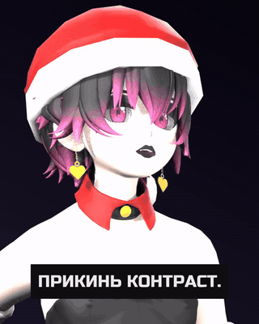

# blender-vrchat-lipsync

Turn a WAV file into a talking 3D avatar. Fully offline: no neural video models, no paid
APIs, no cloud. Runs on a GTX 1050 (3 GB) — a card that cannot load a single video model.



Feed it recorded speech plus the script, get back a vertical video: the character speaks
the line phoneme by phoneme, gestures, blinks, subtitles run along the bottom.

## How it works

Lip sync is not painted by a neural net and needs no manual face rig. Avatars in the
VRChat format already ship with a standard set of viseme blendshapes — `vrc.v_aa`,
`vrc.v_oh`, `vrc.v_pp` and twelve more. The script is split into phonemes, the phonemes
are mapped onto those visemes using word timings from speech recognition. The mouth opens
exactly when and as far as it should.

```
WAV + script
   │
   ├─ align_words.py       faster-whisper → per-word timings
   ├─ merge_transcript.py  recognised timings + exact words from the script
   ├─ render_avatar.py     Blender: visemes, gestures, blinks → PNG with alpha
   └─ compose_reel.py      background + subtitles → MP4
```

About 0.5 s per frame at 720×900 on a GTX 1050, so a 60-second clip renders in roughly
eleven minutes. Nothing leaves the machine.

The phoneme map in `render_avatar.py` is written for Russian; for another language, edit
the `VIS` dictionary (letter → viseme).

## Requirements

- Blender 4.2+ (tested on 5.2)
- Python 3.10+, `faster-whisper`
- ffmpeg and ffprobe in PATH

Assets are not included — their licences do not allow redistribution:

- **avatar** — any VRChat-format model with `vrc.v_*` visemes (FBX);
  check with `blender -b --python scripts/inspect_visemes.py -- avatar.fbx`
- **animations** — free clips from [Mixamo](https://www.mixamo.com) (Talking, Idle,
  Arguing); download as FBX without skin

## Usage

```bash
# 1. Word timings
python scripts/align_words.py voice.wav words.json

# 2. Replace recognised text with the exact script
python scripts/merge_transcript.py words.json script.txt aligned.json

# 3. Render the avatar (PNG with alpha)
blender -b --python scripts/render_avatar.py -- \
    avatar.fbx aligned.json out/frames 24 0 "Talking.fbx;Talking (1).fbx" head

# 4. Compose the video
python scripts/compose_reel.py out/frames aligned.json voice.wav reel.mp4 24 56
```

Render arguments: `<avatar> <timings> <out dir> [fps] [seconds, 0 = full length]
[animations separated by ;] [shot: head|waist|body|reel]`

Frame size comes from `AVATAR_W` / `AVATAR_H` (720×900 by default).

## Helper scripts

| script | what it is for |
|---|---|
| `inspect_visemes.py` | does the model have visemes, textures, bones |
| `dump_bones.py` | full skeleton hierarchy — needed for bone mapping |
| `list_anims.py` | clip length and rig type |
| `check_loop.py` | verify a clip loops without drift |
| `head_preview.py` | one lit, textured frame to pick the framing |
| `unpack_unitypackage.py` | unpack `.unitypackage` restoring original names |

## Rakes I stepped on

Collected while building this. If you are doing something similar, this will save you an
evening.

**Animation retarget.** You cannot copy local bone rotations from Mixamo onto a VRChat
skeleton: the bones lie along the same axis but are rolled differently around it, and the
arms end up above the head. What must be transferred is the *deviation from the bone's own
rest pose*: `delta = pose_world · rest_world⁻¹`, then `delta · rest_target`.

**Traversal order.** Apply bones root to leaf, otherwise a parent overwrites its child.

**`view_layer.update()` after assigning a matrix** recomputes the pose from the keys
already inserted and wipes your assignment. Update *before*, not after.

**Looping.** A `CYCLES` modifier on f-curves drifts, and the drift accumulates with every
repeat. Explicit frame mapping is reliable: `start + (frame % period)`.

**Blending clips** — only at the *start* of a segment, where the previous clip keeps
playing past its own boundary. Blend at the end and the new clip plays a few frames before
snapping back to zero. Matrices cannot be interpolated linearly either — you need slerp on
quaternions, or the pose travels the chord instead of the arc.

**Textures.** Unity does not write them into the FBX — find them next to the file and wire
them up by hand, strictly inside the model's own folder tree, or you will pull in another
character's texture.

**Rendering.** `BLENDER_WORKBENCH` is an unlit mode; you need EEVEE with lights. Sixteen
samples instead of the default 64, with GTAO/bloom/SSR off, makes a frame three times
faster with no visible difference on a flat-shaded model.

**Subtitles.** Split lines by length, not by word count, or the block height jumps around.
Replace em dashes and typographic quotes with ASCII: many fonts lack them and libass
silently substitutes another face for the whole line.

**Blender 5 API.** The engine is called `BLENDER_EEVEE`, `Bone` no longer has `.select`,
and action f-curves live under `layers → strips → channelbags` rather than
`action.fcurves`.

## Built with this

A Russian-language philosophy shorts channel runs entirely on this pipeline —
[@knittingarchbuccal](https://www.youtube.com/@knittingarchbuccal). Every clip there is
rendered by this code on that same GTX 1050.

## Licence

MIT — see [LICENSE](LICENSE).

The licence covers the code. Avatars, animations and fonts you plug in stay under their
authors' licences.
